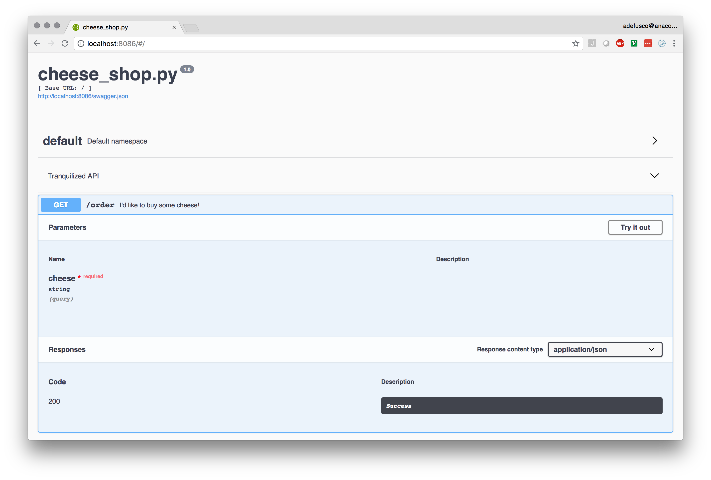

# Tranquilizer

*Put your functions to REST*

## Quick start

In a script file called `cheese_shop.py` the decorated function
will be served as an end point called `cheese` with the GET method.

See the [complete description of `@tranquilize()`](#complete-description) below.

```python
from tranquilizer import tranquilize

@tranquilize()
def order(cheese):
    '''I'd like to buy some cheese!'''
    return {'response':"I'm afraid we're fresh out of {}, Sir.".format(cheese)}
```

The REST API is served by [Flask](http://flask.pocoo.org/) and [Flask-RESTPlus](http://flask-restplus.readthedocs.io/en/stable/index.html)
using the `tranquilizer` command.


```
> tranquilizer cheese_shop.py
 * Serving Flask app "tranquilizer.application" (lazy loading)
 * Environment: production
   WARNING: Do not use the development server in a production environment.
   Use a production WSGI server instead.
 * Debug mode: off
 * Running on http://0.0.0.0:8086/ (Press CTRL+C to quit)

```

Let's see if there is any Red Leicester.

```
> curl -G http://localhost:8086/order --data-urlencode "cheese=Red Leicester"
{"response":"I'm afraid we're fresh out of Red Leicester, Sir."}
```

How about in Python?

```python
In [1]: import requests

In [2]: response = requests.get('http://localhost:8086/order', params={'cheese':'Red Leicester'})

In [3]: response.json()
Out[3]: {'response': "I'm afraid we're fresh out of Red Leicester, Sir."}
```

The *tranquilized* API is documented with [Swagger](https://swagger.io/tools/open-source/) and is accessible
in your web browser at [http://localhost:8086](http://localhost:8086).



## Complete Description
